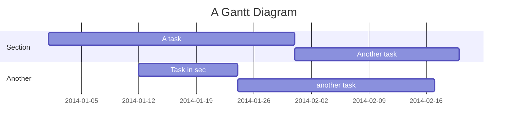

<!--MERMAID {width:100}-->

<!--MCONTENT {content: "gantt \ntitle A Gantt Diagram \ndateFormat YYYY-MM-DD \nsection Section \nA task :a1, 2014-01-01, 30d \nAnother task :after a1 , 20d \nsection Another \nTask in sec :2014-01-12 , 12d \nanother task : 24d \n "} --->

 

## This is heading

 

This file was generated by Swimm. [Click here to view it in the app](https://app.swimm.io/repos/Z2l0aHViJTNBJTNBdG9kby1hcHAlM0ElM0FwcmFmdWxpaWhnbG9iYWw=/docs/wbfg4uwu).
